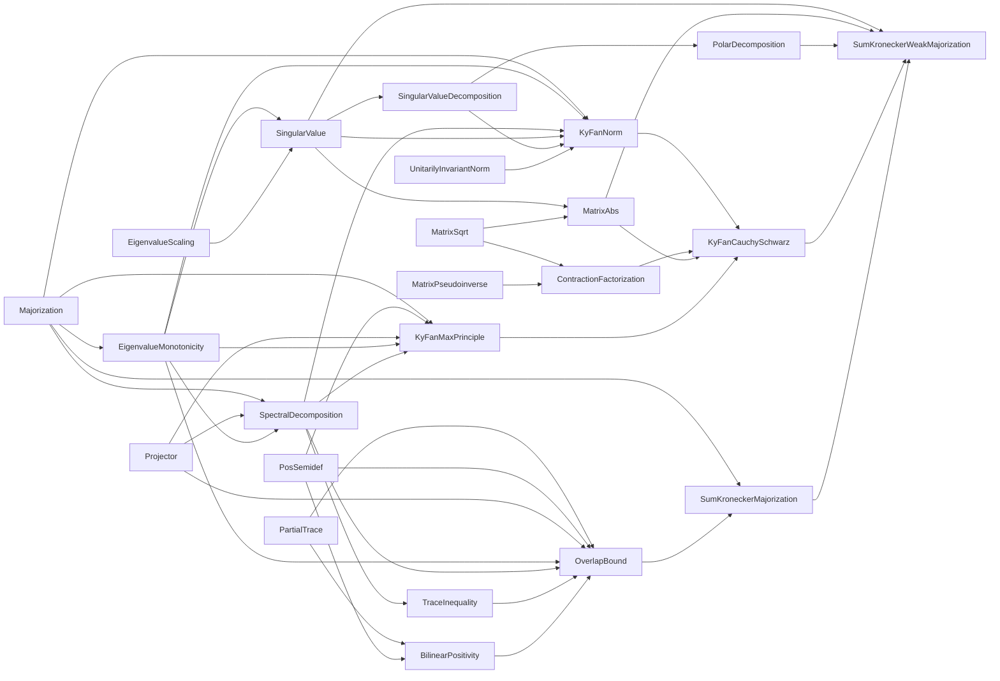

# newProject

A Lean 4 / Mathlib formalization of a chain of matrix-analysis results — partial traces,
positive-semidefiniteness, spectral decomposition, majorization, Weyl monotonicity, and Von
Neumann's trace inequality — building up to bounds on the overlap `Tr[Q(A ⊗ B)]` of a projector
`Q` with a product operator `A ⊗ B`. `NewProject.lean` imports every file below; that's the
project's entry point.

## Dependency graph

## Project structure

The project is split into two parts:

* [`NewProject/ForMathlib/`](NewProject/ForMathlib) — general-purpose matrix-analysis results (not
  specific to the overlap-bound goal below) that are, in the author's judgment, reasonable
  candidates for upstreaming to Mathlib itself.
* `NewProject/*.lean` (this project's own root) — the overlap-bound-specific chain of results built
  on top of `ForMathlib/`, culminating in the final theorem.

Files are listed in rough dependency order (later files import earlier ones).

**Status** is `complete` (no `sorry`s anywhere in the file) or `in progress` (at least one `sorry`
remains). This column is maintained by hand and can drift out of date — to regenerate it, grep the
file for `sorry` (`grep -n sorry <file>`), keeping in mind that a hit inside a `/- ... -/` doc
comment (e.g. a cross-reference to another file's `sorry`) doesn't count, only one inside a
`theorem`/`lemma` body does. `NewProject.lean` importing every file below is itself worth spot
checking after adding a new file — a `ForMathlib/`/root file left out of that import list is a sign
this table (and the project) is missing it too.

### `NewProject/ForMathlib/`

| File | Purpose | Status |
| --- | --- | --- |
| [`Majorization.lean`](NewProject/ForMathlib/Majorization.lean) | Defines majorization (`≺`) and weak majorization (`≺w`) for tuples `Fin n → ℝ`, since it's not in Mathlib. `decreasingSort`, `topSum`, and `sum_mul_le_topSum` ("top-`k` beats any `[0,1]`-weighted average of the same total mass"), needed by `SumKroneckerMajorization.lean`'s `trace_mul_le_topSum_sortedDiagonal`. | complete |
| [`PartialTrace.lean`](NewProject/ForMathlib/PartialTrace.lean) | Partial trace `traceLeft`/`traceRight` of an operator on `𝕜^m ⊗ 𝕜^n` (indexed as `Matrix (m × n) (m × n) 𝕜`, matching `Matrix.kroneckerMap`'s convention). | complete |
| [`PosSemidef.lean`](NewProject/ForMathlib/PosSemidef.lean) | General facts about `Matrix.PosSemidef`: trace of a product of two PSD matrices is nonnegative, the quadratic-form/trace identity `star u ⬝ᵥ (N *ᵥ u) = Tr[N (u uᴴ)]`, and that a projector (`IsStarProjection`) is PSD. | complete |
| [`Projector.lean`](NewProject/ForMathlib/Projector.lean) | `IsStarProjection.trace_eq_rank`: the trace of a projector equals its rank. | complete |
| [`EigenvalueMonotonicity.lean`](NewProject/ForMathlib/EigenvalueMonotonicity.lean) | Weyl's monotonicity theorem: `B ≤ A` (Loewner order) implies `B`'s eigenvalues are weakly majorized by `A`'s (weak form), and termwise `≤` (pointwise form, not in Mathlib either). Proved via the standard Courant-Fischer subspace-intersection argument, specialized to one index. | complete |
| [`EigenvalueScaling.lean`](NewProject/ForMathlib/EigenvalueScaling.lean) | `Matrix.IsHermitian.eigenvalues₀_smul`: `(c • A).eigenvalues₀ = c • A.eigenvalues₀` for a nonnegative real `c`, not in Mathlib. Needed by `SingularValue.lean`'s `Matrix.singularValues_smul`, in turn needed by `Matrix.kyFanNorm_smul` (`KyFanNorm.lean`). Built from scratch (no `charpoly`-under-`smul` lemma exists in Mathlib) by re-diagonalizing `c • A` along `A`'s own eigenbasis. | complete |
| [`SpectralDecomposition.lean`](NewProject/ForMathlib/SpectralDecomposition.lean) | Derives the "outer product" spectral form `A = ∑ₖ αₖ (uₖ uₖ*)` (Mathlib's `spectral_theorem` only gives the unitary-conjugation form), the telescoping/Abel-summation identity `A = ∑ⱼ (λⱼ(A) - λⱼ₊₁(A)) • P_[j]` used by `OverlapBound.lean`, and the rank-`k` spectral truncation projector `topProjector`/its "self" Ky Fan equality `Tr[topProjector k · A] = topSum (eigenvalues₀) k` used by `SumKroneckerMajorization.lean`. | complete |
| [`TraceInequality.lean`](NewProject/ForMathlib/TraceInequality.lean) | Von Neumann's trace inequality: `Tr[AB] ≤ ∑ᵢ λᵢ(A) λᵢ(B)` for Hermitian `A, B`, eigenvalues sorted decreasing. Not in Mathlib. | complete |
| [`SingularValue.lean`](NewProject/ForMathlib/SingularValue.lean) | `Matrix.singularValues`: singular values of a square matrix (not necessarily Hermitian/PSD), sorted decreasing, as square roots of `(Aᴴ A)`'s eigenvalues — the `Fin (Fintype.card ι) → ℝ` shape `Majorization.lean`'s `≺w` needs, absent from Mathlib. | complete |
| [`SingularValueDecomposition.lean`](NewProject/ForMathlib/SingularValueDecomposition.lean) | The full SVD factorization `A = U * Σ * Vᴴ` of a square matrix, absent from Mathlib (which only has the singular-value sequence). | complete |
| [`UnitarilyInvariantNorm.lean`](NewProject/ForMathlib/UnitarilyInvariantNorm.lean) | `Matrix.IsUnitarilyInvariantNorm`: the general notion of a norm on square matrices invariant under two-sided unitary conjugation, following Bhatia's textbook definition. | complete |
| [`KyFanNorm.lean`](NewProject/ForMathlib/KyFanNorm.lean) | `Matrix.kyFanNorm k A`: the sum of the `k` largest singular values of `A`, the standard first family of examples of a unitarily invariant norm. Definiteness (`kyFanNorm_eq_zero_iff`), homogeneity (`kyFanNorm_smul`), and the triangle inequality (`kyFanNorm_add_le`, via a Jordan–Wielandt dilation argument) are all proved. `isUnitarilyInvariantNorm_kyFanNorm` assembles these into a `Matrix.IsUnitarilyInvariantNorm` instance. | complete |
| [`MatrixSqrt.lean`](NewProject/ForMathlib/MatrixSqrt.lean) | `Matrix.PosSemidef.sqrt`: the PSD square root of a PSD matrix, via the continuous functional calculus for Hermitian matrices, plus uniqueness (`sqrt_unique`) and Kronecker-multiplicativity (`sqrt_kronecker`). | complete |
| [`MatrixPseudoinverse.lean`](NewProject/ForMathlib/MatrixPseudoinverse.lean) | `Matrix.PosSemidef.pinv`: the pseudoinverse of a PSD matrix, via `cfc (·⁻¹)`. The defining identities (`mul_pinv_mul_self`, `pinv_mul_self_mul_pinv`, `mul_pinv_eq_pinv_mul`) and the range-projector facts built from them (`isStarProjection_mul_pinv`/`isStarProjection_pinv_mul`) are all proved. Needed by `ContractionFactorization.lean`. | complete |
| [`ContractionFactorization.lean`](NewProject/ForMathlib/ContractionFactorization.lean) | `Matrix.IsContraction` (`K * Kᴴ ≤ 1`) plus Douglas' factorization lemma: if `[[X,Z],[Zᴴ,Y]]` is PSD, `Z = X.sqrt * K * Y.sqrt` for a contraction `K`, needed by `KyFanCauchySchwarz.lean`. Not in Mathlib or this project otherwise. Proved via the classical range/kernel-inclusion plus generalized Schur complement argument (Douglas 1966 / Albert 1969), built on `MatrixPseudoinverse.lean`'s pseudoinverse identities. | complete |
| [`MatrixAbs.lean`](NewProject/ForMathlib/MatrixAbs.lean) | `Matrix.abs M := (Mᴴ * M).sqrt`, the absolute value of a general square matrix: `posSemidef_abs`, `abs_kronecker` (`\|A⊗B\| = \|A\|⊗\|B\|`), `abs_eigenvalues₀_eq_singularValues`, and `singularValues_conjTranspose` (`σ(Mᴴ)=σ(M)`). | complete |
| [`PolarDecomposition.lean`](NewProject/ForMathlib/PolarDecomposition.lean) | `Matrix.exists_polarDecomposition`: `∃ U` unitary, `M = U * \|M\|`, derived from `SingularValueDecomposition.lean`'s `exists_svd`. | complete |
| [`KyFanMaxPrinciple.lean`](NewProject/ForMathlib/KyFanMaxPrinciple.lean) | The general Ky Fan maximum principle `Tr[Q·A] ≤ topSum A.eigenvalues₀ k` for Hermitian `A` and **any** rank-`k` star-projection `Q` (not just `A`'s own `topProjector k`), needed by `KyFanCauchySchwarz.lean`. The main theorem, `trace_mul_le_topSum_of_isStarProjection`, is proved from three sub-lemmas (trace expansion, `[0,1]`-diagonal bound, diagonal-sums-to-rank). | complete |
| [`KyFanCauchySchwarz.lean`](NewProject/ForMathlib/KyFanCauchySchwarz.lean) | The Cauchy–Schwarz inequality for Ky Fan norms of rectangular operators, `(Lᴴ*R).kyFanNorm k ≤ √((Lᴴ*L).kyFanNorm k · (Rᴴ*R).kyFanNorm k)` — the hardest, genuinely new piece of matrix analysis needed by `SumKroneckerWeakMajorization.lean`. Proved via the block-PSD Ky Fan bound `kyFanNorm_le_max_of_fromBlocks_posSemidef`, which chains `ContractionFactorization.lean`'s Douglas factorization `Z = X.sqrt*K*Y.sqrt` with this file's `kyFanNorm_sqrt_mul_contraction_mul_sqrt_le_max` (the sandwiched-contraction Ky Fan bound, a form of the Bhatia–Kittaneh inequality). That last lemma rests on `KyFanNorm.lean`'s `exists_isometryPair_trace_eq_kyFanNorm`. | complete |

### `NewProject/` (project-specific)

| File | Purpose | Status |
| --- | --- | --- |
| [`BilinearPositivity.lean`](NewProject/BilinearPositivity.lean) | `Φ(C, A) := Tr₁[C(A ⊗ 1)]` is jointly positive: `C, A` PSD implies `Φ(C, A)` PSD. | complete |
| [`OverlapBound.lean`](NewProject/OverlapBound.lean) | Bounds `Tr[Q(A ⊗ B)]` for a projector `Q`: the special case `A = P` a rank-`r` projector (`trace_mul_kronecker_le_sum_min`), and the general PSD-`A` case (`trace_mul_kronecker_le_sum_min_diff`). | complete |
| [`SumKroneckerMajorization.lean`](NewProject/SumKroneckerMajorization.lean) | **PSD case**: `λ(∑ᵢ A⁽ⁱ⁾ ⊗ B⁽ⁱ⁾) ≺ λ(∑ᵢ A⁽ⁱ⁾↓ ⊗ B⁽ⁱ⁾↓)` for PSD families `A⁽ⁱ⁾`, `B⁽ⁱ⁾`, where `X↓` is the diagonal matrix of `X`'s sorted eigenvalues. Built from `Matrix.IsHermitian.topSum_eigenvalues₀_diagonal` (`topSum` of a diagonal Hermitian's `eigenvalues₀` is basis/enumeration-independent) and `trace_mul_le_topSum_sortedDiagonal` (assembles the weak-majorization bound `Tr[Q·∑ᵢA⁽ⁱ⁾⊗B⁽ⁱ⁾] ≤ topSum` from `OverlapBound.lean`'s per-family bound). | complete |
| [`SumKroneckerWeakMajorization.lean`](NewProject/SumKroneckerWeakMajorization.lean) | **Final theorem**: `σ(∑ᵢ A⁽ⁱ⁾ ⊗ B⁽ⁱ⁾) ≺w ∑ᵢ σ(A⁽ⁱ⁾)⊗σ(B⁽ⁱ⁾)` for general (not necessarily Hermitian/PSD) families `A⁽ⁱ⁾`, `B⁽ⁱ⁾` — generalizes `SumKroneckerMajorization.lean`'s PSD case, where singular values become eigenvalues and weak majorization strengthens to majorization. Module doc lays out the full 10-step Rico–Wolf reduction to the PSD case. | complete |