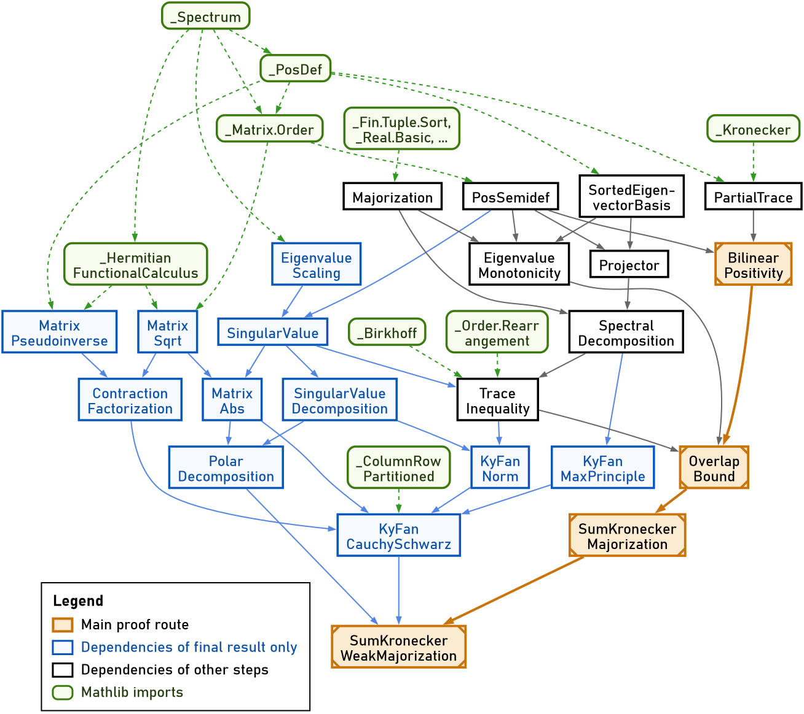

# The Separable Fan Majorization — two-fold case

A Lean 4 / Mathlib verification of the separable Ky Fan majorization for `n = 2` tensor factors and
any number `m` of summands, following the proof of [WZ26] and built with the help of Claude Code.
It accompanies the thesis *The Separable Fan Majorization*.

Ky Fan's majorization theorem compares the eigenvalues of a sum of Hermitian matrices with the sums
of their sorted eigenvalues. The separable version asks whether the same relation survives when each
summand is split into tensor factors. [AK26], [GW26] and [WZ26] showed that it holds for `n ≤ 2`
tensor factors or `m ≤ 2` summands, and fails in general beyond that. This project verifies both
forms of the two-fold case:

* **Positive semidefinite case** (eigenvalue majorization): for PSD families `A⁽ⁱ⁾`, `B⁽ⁱ⁾`,

  ```text
  λ(∑ᵢ A⁽ⁱ⁾ ⊗ B⁽ⁱ⁾) ≺ ∑ᵢ λ(A⁽ⁱ⁾) ⊗ λ(B⁽ⁱ⁾)
  ```

  where `λ` denotes eigenvalues sorted decreasingly
  (`majorized_sum_kronecker_sortedDiagonal` in
  [`SumKroneckerMajorization.lean`](SeparableFanMajorization/SumKroneckerMajorization.lean)).
* **General case** (singular-value weak majorization): for arbitrary square families `A⁽ⁱ⁾`, `B⁽ⁱ⁾`,

  ```text
  σ(∑ᵢ A⁽ⁱ⁾ ⊗ B⁽ⁱ⁾) ≺w ∑ᵢ σ(A⁽ⁱ⁾) ⊗ σ(B⁽ⁱ⁾)
  ```

  where `σ` denotes singular values sorted decreasingly
  (`weakMajorized_sum_kronecker_singularValueDiagonal` in
  [`SumKroneckerWeakMajorization.lean`](SeparableFanMajorization/SumKroneckerWeakMajorization.lean)).

Along the way the project develops a chain of matrix-analysis results not yet in Mathlib — partial
traces, spectral and singular value decompositions, majorization, Weyl monotonicity, Von Neumann's
trace inequality, and Ky Fan norms — together with bounds on the overlap `Tr[Q(A ⊗ B)]` of a
projector `Q` with a product operator `A ⊗ B`. `SeparableFanMajorization.lean` imports every file
below; that's the project's entry point.

## Dependency graph



The graph is generated from [`dependency-graph.dot`](dependency-graph.dot) with
`dot -Tsvg:cairo dependency-graph.dot -o dependency-graph.svg` ([Graphviz](https://graphviz.org)).

## Project structure

The project is split into two parts:

* [`SeparableFanMajorization/ForMathlib/`](SeparableFanMajorization/ForMathlib) — general-purpose
  matrix-analysis results (not specific to the main theorem) that are, in the author's judgment,
  reasonable candidates for upstreaming to Mathlib itself.
* [`SeparableFanMajorization/`](SeparableFanMajorization) (the project's own root) — the chain of
  results specific to the main theorem, built on top of `ForMathlib/`.

Files are listed in rough dependency order (later files import earlier ones).

### `SeparableFanMajorization/ForMathlib/`

| File | Purpose |
| --- | --- |
| [`Majorization.lean`](SeparableFanMajorization/ForMathlib/Majorization.lean) | Defines majorization (`≺`) and weak majorization (`≺w`) for tuples `Fin n → ℝ`, since it's not in Mathlib. `decreasingSort`, `topSum`, `decreasingSort_of_antitone` (an already-sorted tuple is its own `decreasingSort`, used by `EigenvalueMonotonicity.lean`/`SpectralDecomposition.lean`/`KyFanNorm.lean` to unfold `topSum` over `eigenvalues₀`), and `sum_mul_le_topSum` ("top-`k` beats any `[0,1]`-weighted average of the same total mass"), needed by `SumKroneckerMajorization.lean`'s `trace_mul_le_topSum_sortedDiagonal`. |
| [`PartialTrace.lean`](SeparableFanMajorization/ForMathlib/PartialTrace.lean) | Partial trace `traceLeft`/`traceRight` of an operator on `𝕜^m ⊗ 𝕜^n` (indexed as `Matrix (m × n) (m × n) 𝕜`, matching `Matrix.kroneckerMap`'s convention). |
| [`PosSemidef.lean`](SeparableFanMajorization/ForMathlib/PosSemidef.lean) | General facts about `Matrix.PosSemidef`: trace of a product of two PSD matrices is nonnegative, the quadratic-form/trace identity `star u ⬝ᵥ (N *ᵥ u) = Tr[N (u uᴴ)]`, and that a projector (`IsStarProjection`) is PSD. |
| [`Projector.lean`](SeparableFanMajorization/ForMathlib/Projector.lean) | `IsStarProjection.trace_eq_rank`: the trace of a projector equals its rank. |
| [`SortedEigenvectorBasis.lean`](SeparableFanMajorization/ForMathlib/SortedEigenvectorBasis.lean) | `Matrix.IsHermitian.sortedEigenvectorBasis`: reindexes Mathlib's `eigenvectorBasis` (indexed by the matrix's own index type `n`) by `Fin (Fintype.card n)` so it lines up positionally with `eigenvalues₀`, plus `mulVec_sortedEigenvectorBasis`/`orthonormal_sortedEigenvectorBasis` and the `eigenvalues₀`-indexed `PosSemidef.eigenvalues₀_nonneg`. Split out of `EigenvalueMonotonicity.lean` since `Projector.lean`, `SpectralDecomposition.lean`, `KyFanMaxPrinciple.lean`, `KyFanNorm.lean`, and `SingularValue.lean` only need this reindexing, not Weyl monotonicity itself. |
| [`EigenvalueMonotonicity.lean`](SeparableFanMajorization/ForMathlib/EigenvalueMonotonicity.lean) | Weyl's monotonicity theorem: `B ≤ A` (Loewner order) implies `B`'s eigenvalues are weakly majorized by `A`'s (weak form), and termwise `≤` (pointwise form, not in Mathlib either). Proved via the standard Courant-Fischer subspace-intersection argument, specialized to one index. |
| [`EigenvalueScaling.lean`](SeparableFanMajorization/ForMathlib/EigenvalueScaling.lean) | `Matrix.IsHermitian.eigenvalues₀_smul`: `(c • A).eigenvalues₀ = c • A.eigenvalues₀` for a nonnegative real `c`, not in Mathlib. Needed by `SingularValue.lean`'s `Matrix.singularValues_smul`, in turn needed by `Matrix.kyFanNorm_smul` (`KyFanNorm.lean`). Built from scratch (no `charpoly`-under-`smul` lemma exists in Mathlib) by re-diagonalizing `c • A` along `A`'s own eigenbasis. |
| [`SpectralDecomposition.lean`](SeparableFanMajorization/ForMathlib/SpectralDecomposition.lean) | Derives the "outer product" spectral form `A = ∑ₖ αₖ (uₖ uₖ*)` (Mathlib's `spectral_theorem` only gives the unitary-conjugation form), the telescoping/Abel-summation identity `A = ∑ⱼ (λⱼ(A) - λⱼ₊₁(A)) • P_[j]` used by `OverlapBound.lean`, and the rank-`k` spectral truncation projector `topProjector`/its "self" Ky Fan equality `Tr[topProjector k · A] = topSum (eigenvalues₀) k` used by `SumKroneckerMajorization.lean`. |
| [`TraceInequality.lean`](SeparableFanMajorization/ForMathlib/TraceInequality.lean) | Von Neumann's trace inequality: `Tr[AB] ≤ ∑ᵢ λᵢ(A) λᵢ(B)` for Hermitian `A, B`, eigenvalues sorted decreasing. Not in Mathlib. |
| [`SingularValue.lean`](SeparableFanMajorization/ForMathlib/SingularValue.lean) | `Matrix.singularValues`: singular values of a square matrix (not necessarily Hermitian/PSD), sorted decreasing, as square roots of `(Aᴴ A)`'s eigenvalues — the `Fin (Fintype.card ι) → ℝ` shape `Majorization.lean`'s `≺w` needs, absent from Mathlib. |
| [`SingularValueDecomposition.lean`](SeparableFanMajorization/ForMathlib/SingularValueDecomposition.lean) | The full SVD factorization `A = U * Σ * Vᴴ` of a square matrix, absent from Mathlib (which only has the singular-value sequence). |
| [`KyFanNorm.lean`](SeparableFanMajorization/ForMathlib/KyFanNorm.lean) | `Matrix.kyFanNorm k A`: the sum of the `k` largest singular values of `A`, a unitarily invariant norm (Bhatia's textbook definition, *Matrix Analysis*, IV.1). Definiteness (`kyFanNorm_eq_zero_iff`), homogeneity (`kyFanNorm_smul`), unitary invariance (`Matrix.singularValues_unitary_conj`, `SingularValue.lean`), and the triangle inequality (`kyFanNorm_add_le`, via a Jordan–Wielandt dilation argument) are all proved. |
| [`MatrixSqrt.lean`](SeparableFanMajorization/ForMathlib/MatrixSqrt.lean) | `Matrix.PosSemidef.sqrt`: the PSD square root of a PSD matrix, via the continuous functional calculus for Hermitian matrices, plus uniqueness (`sqrt_unique`) and Kronecker-multiplicativity (`sqrt_kronecker`). |
| [`MatrixPseudoinverse.lean`](SeparableFanMajorization/ForMathlib/MatrixPseudoinverse.lean) | `Matrix.PosSemidef.pinv`: the pseudoinverse of a PSD matrix, via `cfc (·⁻¹)`. The defining identities (`mul_pinv_mul_self`, `pinv_mul_self_mul_pinv`, `mul_pinv_eq_pinv_mul`) and the range-projector facts built from them (`isStarProjection_mul_pinv`/`isStarProjection_pinv_mul`) are all proved. Needed by `ContractionFactorization.lean`. |
| [`ContractionFactorization.lean`](SeparableFanMajorization/ForMathlib/ContractionFactorization.lean) | `Matrix.IsContraction` (`K * Kᴴ ≤ 1`) plus Douglas' factorization lemma: if `[[X,Z],[Zᴴ,Y]]` is PSD, `Z = X.sqrt * K * Y.sqrt` for a contraction `K`, needed by `KyFanCauchySchwarz.lean`. Not in Mathlib or this project otherwise. Proved via the classical range/kernel-inclusion plus generalized Schur complement argument (Douglas 1966 / Albert 1969), built on `MatrixPseudoinverse.lean`'s pseudoinverse identities. |
| [`MatrixAbs.lean`](SeparableFanMajorization/ForMathlib/MatrixAbs.lean) | `Matrix.abs M := (Mᴴ * M).sqrt`, the absolute value of a general square matrix: `posSemidef_abs`, `abs_kronecker` (`\|A⊗B\| = \|A\|⊗\|B\|`), `abs_eigenvalues₀_eq_singularValues`, and `singularValues_conjTranspose` (`σ(Mᴴ)=σ(M)`). |
| [`PolarDecomposition.lean`](SeparableFanMajorization/ForMathlib/PolarDecomposition.lean) | `Matrix.exists_polarDecomposition`: `∃ U` unitary, `M = U * \|M\|`, derived from `SingularValueDecomposition.lean`'s `exists_svd`. |
| [`KyFanMaxPrinciple.lean`](SeparableFanMajorization/ForMathlib/KyFanMaxPrinciple.lean) | The general Ky Fan maximum principle `Tr[Q·A] ≤ topSum A.eigenvalues₀ k` for Hermitian `A` and **any** rank-`k` star-projection `Q` (not just `A`'s own `topProjector k`), needed by `KyFanCauchySchwarz.lean`. The main theorem, `trace_mul_le_topSum_of_isStarProjection`, is proved from three sub-lemmas (trace expansion, `[0,1]`-diagonal bound, diagonal-sums-to-rank). |
| [`KyFanCauchySchwarz.lean`](SeparableFanMajorization/ForMathlib/KyFanCauchySchwarz.lean) | The Cauchy–Schwarz inequality for Ky Fan norms of rectangular operators, `(Lᴴ*R).kyFanNorm k ≤ √((Lᴴ*L).kyFanNorm k · (Rᴴ*R).kyFanNorm k)` — the hardest, genuinely new piece of matrix analysis needed by `SumKroneckerWeakMajorization.lean`. Proved via the block-PSD Ky Fan bound `kyFanNorm_le_max_of_fromBlocks_posSemidef`, which chains `ContractionFactorization.lean`'s Douglas factorization `Z = X.sqrt*K*Y.sqrt` with this file's `kyFanNorm_sqrt_mul_contraction_mul_sqrt_le_max` (the sandwiched-contraction Ky Fan bound, a form of the Bhatia–Kittaneh inequality). That last lemma rests on `KyFanNorm.lean`'s `exists_isometryPair_trace_eq_kyFanNorm`. |
### `SeparableFanMajorization/` (project-specific)

| File | Purpose |
| --- | --- |
| [`BilinearPositivity.lean`](SeparableFanMajorization/BilinearPositivity.lean) | `Φ(C, A) := Tr₁[C(A ⊗ 1)]` is jointly positive: `C, A` PSD implies `Φ(C, A)` PSD. |
| [`OverlapBound.lean`](SeparableFanMajorization/OverlapBound.lean) | Bounds `Tr[Q(A ⊗ B)]` for a projector `Q`: the special case `A = P` a rank-`r` projector (`trace_mul_kronecker_le_sum_min`), and the general PSD-`A` case (`trace_mul_kronecker_le_sum_min_diff`). |
| [`SumKroneckerMajorization.lean`](SeparableFanMajorization/SumKroneckerMajorization.lean) | **PSD case**: `λ(∑ᵢ A⁽ⁱ⁾ ⊗ B⁽ⁱ⁾) ≺ ∑ᵢ λ(A⁽ⁱ⁾) ⊗ λ(B⁽ⁱ⁾)` for PSD families `A⁽ⁱ⁾`, `B⁽ⁱ⁾`, the right-hand side realized as the eigenvalues of `∑ᵢ sortedDiagonal A⁽ⁱ⁾ ⊗ₖ sortedDiagonal B⁽ⁱ⁾`. Built from `Matrix.IsHermitian.topSum_eigenvalues₀_diagonal` (`topSum` of a diagonal Hermitian's `eigenvalues₀` is basis/enumeration-independent) and `trace_mul_le_topSum_sortedDiagonal` (assembles the weak-majorization bound `Tr[Q·∑ᵢA⁽ⁱ⁾⊗B⁽ⁱ⁾] ≤ topSum` from `OverlapBound.lean`'s per-family bound). |
| [`SumKroneckerWeakMajorization.lean`](SeparableFanMajorization/SumKroneckerWeakMajorization.lean) | **Final theorem**: `σ(∑ᵢ A⁽ⁱ⁾ ⊗ B⁽ⁱ⁾) ≺w ∑ᵢ σ(A⁽ⁱ⁾)⊗σ(B⁽ⁱ⁾)` for general (not necessarily Hermitian/PSD) families `A⁽ⁱ⁾`, `B⁽ⁱ⁾` — generalizes `SumKroneckerMajorization.lean`'s PSD case, where singular values become eigenvalues and weak majorization strengthens to majorization. Module doc lays out the full 10-step [WZ26] reduction to the PSD case. |
## References

* **[AK26]** M. A. Alhejji and C. Kelson-Packer, *A majorization relation for a sum of two tensor
  products of positive semidefinite operators*, 2026.
  [arXiv:2607.07913](https://arxiv.org/abs/2607.07913)
* **[GW26]** A. E. Guterman and M. M. Wolf, *Poset-refined majorization relations*, 2026.
  [arXiv:2607.28061](https://arxiv.org/abs/2607.28061)
* **[WZ26]** M. M. Wolf and Y. Zhou, *Ky Fan majorization for binary tensor products*, 2026.
  [arXiv:2607.27116](https://arxiv.org/abs/2607.27116)
